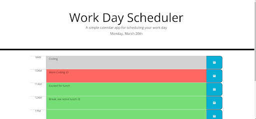

# Work Day Scheduler

## Description
This is a planner that will let you enter text corresponding to an hour. The hour blocks will have a grey background if they have already passed for the day, a red background if it is the current hour, and a green background if it is a future hour. The text will be saved to local storage and will persist even if the page is refreshed. The current day is displayed at the top of the page.

## Usage
Lets the user plan their day by the hour. All plans entered will be saved to local storage and will persist even if the page is refreshed.

## Screenshot

## URL

## Contact
logsenn2@gmail.com